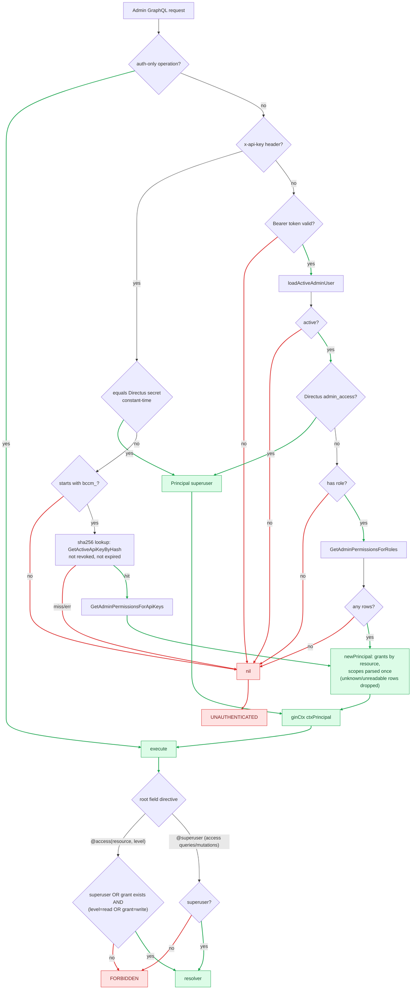

# Admin API access

How `AuthExtension` (`backend/graph/admin/auth.go`) turns a request into a `Principal`, and how `@access` / `@superuser` check it. Green paths succeed, red ones fail.

```mermaid
flowchart TD
  REQ[Admin GraphQL request]
  AO{auth-only operation?}
  K{x-api-key header?}
  DS{"equals Directus secret<br/>constant-time"}
  SU[Principal superuser]
  PFX{starts with bccm_?}
  X[nil]
  H["sha256 lookup: GetActiveApiKeyByHash<br/>not revoked, not expired"]
  KP[GetAdminPermissionsForApiKeys]
  B{Bearer token valid?}
  U[loadActiveAdminUser]
  ACT{active?}
  ADM{Directus admin_access?}
  RL{has role?}
  RP[GetAdminPermissionsForRoles]
  ANY{any rows?}
  NP["newPrincipal: grants by resource,<br/>scopes parsed once<br/>(unknown/unreadable rows dropped)"]
  UN[UNAUTHENTICATED]
  SET[ginCtx ctxPrincipal]
  EXEC[execute]
  D{root field directive}
  AC{"superuser OR grant exists AND<br/>(level=read OR grant=write)"}
  SC{superuser?}
  FB[FORBIDDEN]
  RES[resolver]
  REQ --> AO
  AO -->|"yes"| EXEC
  AO -->|"no"| K
  K -->|"yes"| DS
  DS -->|"yes"| SU
  DS -->|"no"| PFX
  PFX -->|"no"| X
  PFX -->|"yes"| H
  H -->|"miss/err"| X
  H -->|"hit"| KP
  KP --> NP
  K -->|"no"| B
  B -->|"no"| X
  B -->|"yes"| U
  U --> ACT
  ACT -->|"no"| X
  ACT -->|"yes"| ADM
  ADM -->|"yes"| SU
  ADM -->|"no"| RL
  RL -->|"no"| X
  RL -->|"yes"| RP
  RP --> ANY
  ANY -->|"no"| X
  ANY -->|"yes"| NP
  X --> UN
  SU --> SET
  NP --> SET
  SET --> EXEC
  EXEC --> D
  D -->|"@access(resource, level)"| AC
  D -->|"@superuser (access queries/mutations)"| SC
  AC -->|"no"| FB
  SC -->|"no"| FB
  AC -->|"yes"| RES
  SC -->|"yes"| RES
  linkStyle 1,4,9,10,13,16,17,20,23,25,26,27,28,33,34 stroke:#16a34a,stroke-width:2px
  linkStyle 6,8,12,15,19,22,24,31,32 stroke:#dc2626,stroke-width:2px
  classDef ok fill:#dcfce7,stroke:#16a34a,color:#14532d
  classDef fail fill:#fee2e2,stroke:#dc2626,color:#7f1d1d
  class SU,NP,SET,EXEC,RES ok
  class X,UN,FB fail
```
